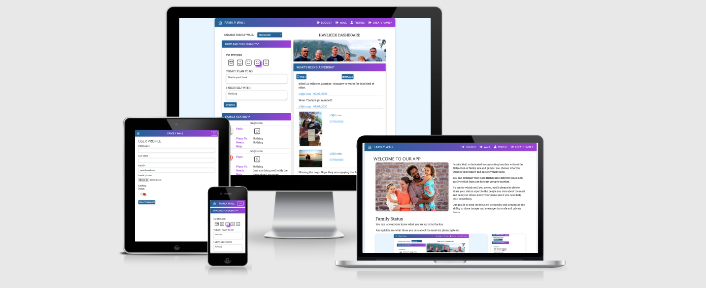
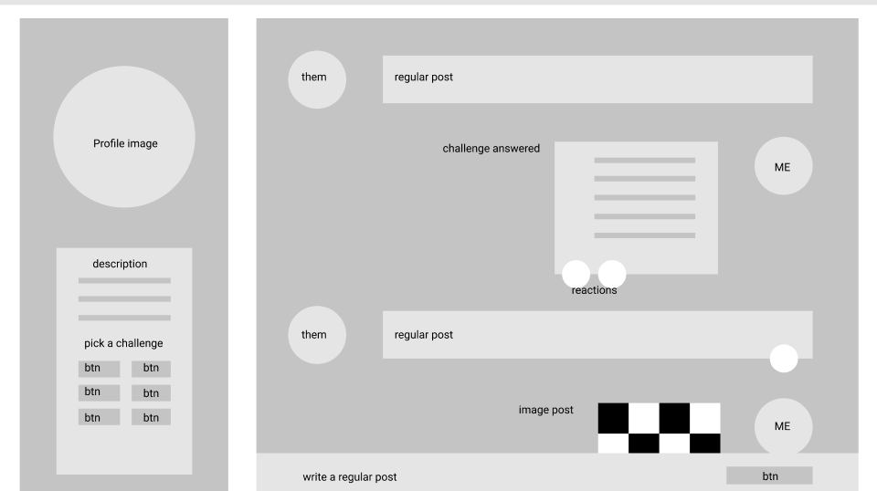
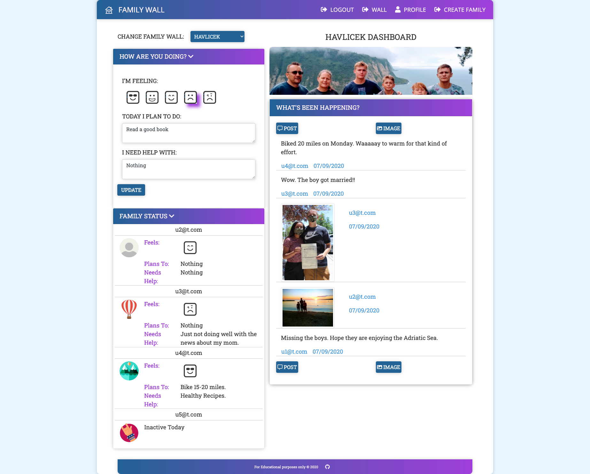
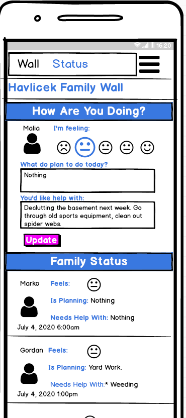
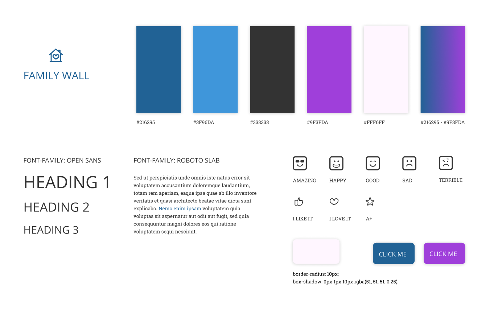
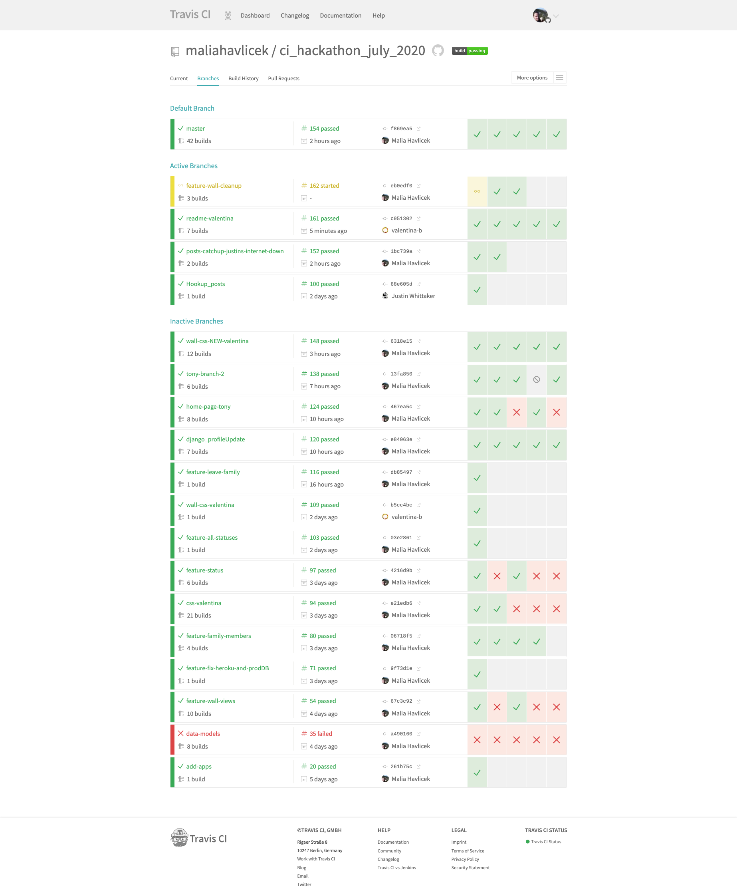
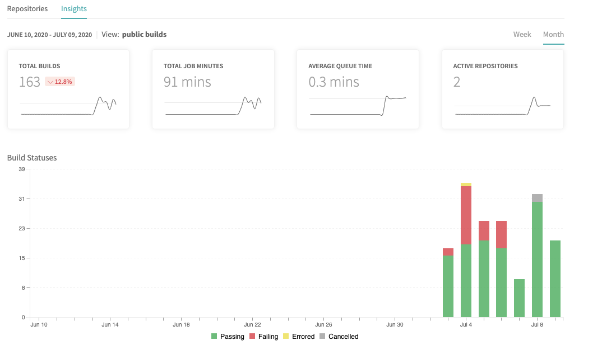

# FAMILY WALL - Online Family Meetup Place

_Code Institute - Hackathon July 2020 - by Malia, Django, Tony, Justin and Valentina (Advanced-B Group)_

Welcome to FAMILY WALL - an online meetup place for family members. 
Family Wall is dedicated to connecting families without the distraction of flashy ads and games. You choose who you want in your family and see only their posts.

You can organize your close friends into different walls and easily switch from one interest group to another. No matter which wall you are on, you'll always be able to share your status report to the people you care about the most and easily let others know your plans and if you need help with something.

Our goal is to keep the focus on the family and streamline the ability to share images and messages in a safe and private forum.



## UX

The results of the latest researches related to the COVID-19 pandemic have one thing in common - people aged 60 and above are more prone to coronavirus infection than any other age group.
It is crucial, therefore, for elderly people to limit their exposure to the virus as much as possible since the consequences can be severe.
Limiting the exposure along with social distancing rules which vary from country to country are more often than not leaving elderly people socially isolated and split off from their families.

As human beings are social animals, social networking is part of our nature.
We also know that social interaction has a positive impact on immune system, physical health and mental sharpness.
Since social distancing rules are still active, older family members are struggling to stay in touch with their families and loved ones - which could potentially have a huge impact on their wellbeing.

Family Wall is primarily created for families with older members who are not able to communicate in person on regular basis with the rest of the family.
It is designed as a combination of a Facebook wall and a private Whatsapp group.
Members of the family wall can update the family on how they are feeling, what are they doing, request help from each other - as well as add posts and images to the wall.

### User Goals

As a user...

* I want to stay in touch with my family so that I don't feel isolated
* I want to know what is happening in lives of other family members so that I don't feel like I'm missing out important things while I'm at home
* I want to be able to request help if I need it from my whole family so that I don't have to constantly annoy only one person
* I want to .............

## Features and App Sections

### App Sections

1. **Top navigation bar** - fixed on the top so that the users are able to navigate themselves back to the homepage, log in to their family wall, register or create a new family wall
1. **Homepage** - provides a short welcome message with the description of the app
1. **Family Wall** - once logged in, a place where all the members of the family can come together and hang out online

### Features

1. **Register** - create an account so that you can be invited to different family groups
1. **Update User Profile** - after the registration, users can update their name and add a profile image
1. **Create a Family Group** - create a family, add a family image and invite other family members to the group
1. **Update Family Group** - update family group image and add new members
1. **Update Your Status** - let others know how are you feeling today, what are your plans and request help from others
1. **Post Messages on the Wall** - post what is on your mind or what you want others to know in the family group
1. **Post Photos on the Wall** - upload images to the wall
1. **React to posts and photos** - choose from 3 different reactions - thumbs up, heart and a star

### Wireframes

Our wireframes were made in [Figma](https://www.figma.com/) and [Balsamiq](https://balsamiq.com/). The PDF of all of our wireframes is available [here.](static/assets/images/readme-files/wireframes.pdf)

Initial low-fi wireframe for desktop:



<!-- Desktop:



Mobile:

 -->

## Graphic Design and Brand Elements

Since our product is primarily made to be used by elderly people, we have put efforts into making sure the app's design is as simple as possible.
On the one hand we have followed industry standards by implementing gradient colour effects to achieve a modern look, while on the other hand - we made sure the design is clean and not overwhelming.

### Fonts

As our first step, we have done a brief research about the fonts used by [Facebook](https://www.facebook.com/) and [Whatsapp](https://www.whatsapp.com/).
Since some of the fonts were copyrighted, we have looked into similar options on [Google Fonts](https://fonts.google.com/) and picked [Open Sans](https://fonts.google.com/specimen/Open+Sans?query=open+sans) and [Roboto Slab](https://fonts.google.com/specimen/Roboto+Slab?query=roboto+slab) for our textual content.

### Colours

As [Facebook](https://www.facebook.com/) and [Whatsapp](https://www.whatsapp.com/), our primary sources of inspiration, tend to use mainly calming colours like blue and green for their UI, we have decided to stay as close as possible to this approach.
Our colour palette relies on colder colours like blue, the colour of trust and loyalty, and purple, the colour of wisdom - with the unique gradient colour combination combining both blue and purple colour.
The clean contrast between the background and clickable elements like buttons is ensured by using lighter shades of blue and purple colour.
The text is mostly written in a darker shade of grey colour for better readability.



### Visual Style

Overall, our visual style is relying on modern UI principles like round corners and light shadows for the elements such as navigation, footer, images and buttons.
Since our product is primarily made to be used by elderly people, our elements and font sizes tend to be larger than what might be expected from modern app UI and we tried to use uppercase text where possible.


## APIs

- [AWS S3 Bucket](https://docs.aws.amazon.com/AmazonS3/latest/dev/UsingBucket.html) - allows seamless uploading of user files to cloud storage using application credentials
- [send_status](status/views.py) - home grown Django Rest Framework api that accepts status from users 
- [get_status](status/views.py) - home grown Django Rest Framework api that gets status for all members of a family and updates status bar on wall

# Defensive Programming

Sites with ownership rules and roles opens a site up to hacking especially if your users are savvy and notice url parameters correlate to database object manipulation. Django is pretty good allowing you to hook in login required for views associated with CRUD options, and form validation is top notch if you definite it yourself. Still I felt the need to add a bit more to prevent more tech aware users from doing naughty things:

## Additional Security Checks
1. Users cannot adjust their urls to try to update other user's profiles.
1. Users cannot Delete members from a Family, they can only create then leave.
1. Users cannot Update profiles for other users. The Profile Update view checks the user's id against the logged in user's id before allowing updates.
1. Users cannot Update User Information for other users. The User Profile view checks the user's id against the logged in user's id before allowing updates.
1. Changing passwords requires sending registered email link and does not auto log in a user. While it's annoying to have to wait for a password reset email, then to login after setting it, this step prevents users from taking account ownership over if they manipulate a password reset for their account and attempt to hack another's and it leads to better retention of the password.
1. Before a user can view a family, family membership is checked.
1. Before a user can submit a post, authentication/membership is checked.

## Custom Validation
1. User Registration and User information Updates
   - Emails are unique to the system, the same email be used by another person likewise for the email address. 
   - We used and Abstract User vs All auth to customize the user out of the box 
1. Posts
   - Challenge end dates must be in the future for creation and updates
   - Creation and Updates check current service level of user for submission types and features before allowing a user to create a new challenge.
   - Before Creation, account limit is checked in case user is sharing account or has another tab open and exceeded limit in that manner
1. Submissions
   - Before Creation and Update, dates are checked to ensure user hasn't left a window open hoping to beat time limit
   - File size limits are checked before a user successfully uploads a file
1. Account Management
  - when a user updates their email, the system is crosschecked for uniqueness of values
1. Editing a Family has custom javascript to ensure that users are not added twice and that users cannot remove other members from the family.
   
[Back To Table of Contents](#table-of-contents)


# Testing

Validation, manual unit, cross browser/cross device, travis, coverage, we roughed in a bit of testing.

# Validation Testing 
Various IDE's Pycharm VSCode and GitPod help do basic linter testing.

CSS Validator Note, any error associated with root: color variables were ignored.
HTML Validator - validation of HTML with Django is pretty useless as all {{}} bracketed values raise errors. I ran only a few files through the validator and instead relied heavily upon pycharm's IDE to identify mismatched tags and closing Django directives.
django-extensions - used for validating templates from the command line python manage.py validate_templates
JavaScript Validator Note any errors for let, variables set in other .js files, and constants were ignored. I also used a more ES6 friendly checker and there were no errors for main.js
Pycharm IDE - PyCharm has inline validation for many file types. Python, CSS, HTML, DJANGO files were continuously tested for validity when using this IDE.

## Unit Testing

As core functionality and features were delivered we manually executed test cases to ensure profiles were updated, families were udpated and status could be changed and posts could be created. Console logs were checked and only favicon 404 errors were checked in.

## Cross Browser/Cross Device Verification
Spot checking of our application was done across the following devices operating systems and screen sizes is as follows:

| DEVICE   | BROWSER | OS      | SCREEN WIDTH    |
|----------|---------|---------|-----------------|
| macbook  | firefox | Mojave  | HD 125-1240     |
| macbook  | safari  | Mojave  | HD 125-1240     |
| macbook  | chrome  | Mojave  | HD 125-1240     |
| motog6   | chrome  | android | XS 360px & less |
| iphoneSE | chrome  | iOs     | XS 360px & less |


## Python Testing
Tests were written for a couple of the accounts forms and views. 

Basic test framework has been installed using django-nose driver. To run tests execute the following command from the terminal window:
 
``` python manage.py test --noinput --settings ci_hackathon_july_2020.settings_test```

[django-nose](https://pypi.org/project/django-nose/) was used to help configure and run the python tests with coverage output.

To run these tests go to the command terminal and:

python manage.py test --noinput --settings ms4_challenger.settings_test
Generate a report coverage report
Generate the HTML coverage html
Open the newly created test_coverage directory in the root of your project folder.
Open the index.html file inside it.
Run the file in the browser to see the output.


## Travis 
Travis continuous integration testing with coverage was set up for this project to run the python tests mentioned above.

[](https://travis-ci.org/maliahavlicek/ci_hackathon_july_2020)

You can see the struggles we had initially with sharing migrations across multiple developers but things got smooth after a day or two.





## Defects
Many issues were discovered during this project, but for the sake of time, not many were documented. They ranged from simply copy paste leftovers where the Create Post had a title of Create Family to the outstand such as the Profile Page can update the email, but doesn't translate over the the user 100% of the time.

### Bugs of Note:
- *Could not get profile image back from the form* forgot the  enctype="multipart/form-data" on the form
- *500 error when doing a post* forgot csrf_token
- *get_status having console errors* variables in status.js led to user_id being used vs user so no match found for elements to replace content in
- *get_status hit rate limit of DJANGO REST FRAMEWORK of 100/min* timing interval logic wasn't resetting the timer so it was not triggerring at desired 2 minutes but at as many as possible
- *Add Member button on Create Family looking odd on small devices* when button text too large for width, the white text would go onto white background, trimmed down wording


### Outstanding Defect
- *Cross Browser Compatibility* - Several forms and pages were developed for desktop first as we see the site being used in desktop. Due to time constraints we did not get 100% of the pages checked or styled

# Deployment

## Requirements
If any of the following are unfamiliar, please click on their associated links as they are necessary when setting the environmental variables required to run this application:

 - an IDE such as [pycharm](https://www.jetbrains.com/pycharm/download) - a tool to help develop software
 - [PIP](https://pip.pypa.io/en/stable/installing/) - coordinates python installation packages
 - [python 3](https://www.python.org/downloads/) - Python is a programming language that lets you work more quickly and integrate your systems more effectively.
 - [git](https://gist.github.com/derhuerst/1b15ff4652a867391f03) -  version control system for code source
 - a [gmail accoount](https://accounts.google.com/signup) 
  > Google recently updated security policies. Now you have to do two things after setting up an app specific email via gmail. 
  > First log out of all gmail accounts and log into the one you are going to use for your application then hit these two URLS:
   1. [turn off captcha](https://accounts.google.com/displayunlockcaptcha)
   1. [less secure settings](https://myaccount.google.com/lesssecureapps?pli=1) 
 - [AWS-S3 (Amazon Web Services - Simple Storage Storage Account)](https://docs.aws.amazon.com/AmazonS3/latest/gsg/SigningUpforS3.html) - web based cloud storage service for online backup of website assets
 - [S3 Bucket](https://docs.aws.amazon.com/AmazonS3/latest/gsg/CreatingABucket.html) - a cloud storage resource which is similar to file folders on a computer's hard drive


## Local Environment
1. Save a copy of the github repository located at https://github.com/maliahavlicek/ci_hackathon_july_2020.git by clicking the 'download.zip' button at the top of the page and extracting the zip file to your chosen folder. If you have Git installed on your system, you can clone the repository with the following command:
   ```bash
   $ git clone https://github.com/maliahavlicek/ci_hackathon_july_2020.git
   ```
1. Open your preferred IDE, then open a terminal session in the unzip folder or cd to the correct location.
1. Set up a virtual environment via this command in the terminal session:
   ```bash 
   python3 manage.py
   ``` 
   > NOTE: The ```python``` prefix of this command and other steps below assumes you are working with a mac and pycharm's IDE. Your command may differ, such as ```python -m .venv venv ...``` or ```py manage.py ...``` or ```.\manage.py ...```
1. Activate the .venv with the command:
   ```bash 
   .venv\Scripts\activate
   ```
   > Again this command may differ depending on your operating system, please check the Python Documentation on [virtual environments](https://docs.python.org/3/library/venv.html) for further instructions.
1. If needed, Upgrade pip locally with:
   ```bash
   pip install --upgrade pip
   ```
1. Install all required modules with the command:
   ```bash
   pip install -r requirements.txt
   ```
1. Create a new file at the base ms4_challenge directory level called env.py:
   ```python
   touch env.py
   ```
1. Copy the following into the env.py file or your environmental variables settings location:
    ```python
    import os
    
    os.environ.setdefault('HOSTNAME', '<your value>')
    os.environ.setdefault('SECRET_KEY', '<your value>')
    os.environ.setdefault('EMAIL_USER', '<your value>')
    os.environ.setdefault('EMAIL_PASS', '<your value>')
    os.environ.setdefault('DATABASE_URL', '<your value>')
    os.environ.setdefault('AWS_ACCESS_KEY_ID', '<your value>')
    os.environ.setdefault('AWS_SECRET_ACCESS_KEY', '<your value>')
    ```
1. Replace <your value> with the values from your own accounts
    - HOSTNAME - should be the local address for the site when running within your own IDE.
    - SECRET_KEY -is a django key a long random string of bytes. For example, copy the output of this to your config: 
        ```bash
       python -c 'import os; print(os.urandom(16))'
        ```
1. Set up the databases by running the following management command in your terminal:
    ```bash
    python manage.py migrate
    ```
1. Create the superuser so you can have access to the django admin, follow the steps necessary to set up the username, email and password by running the following management command in your terminal:
    ```bash
    python manage.py createsuperuser
    ```
1. Start your server by running the following management command in your terminal:
    ```bash
    python manage.py runserver
    ```
1. if using gitpod, update settings.py to include 'localhost' in the ALLOWED_HOSTS

## Heroku

To run this application in a cloud environment to allow visibility to external users, you can deploy the code to Heroku. If you wish to do the same, follow the steps below. Please note this section assumes you have succeeded at running the application in your local environment first.

1. Login to Heroku and set up a new app with a unique name (something like ```<yourname>-family-wall```)
1. On the Resources tab, in the Add-ons field type ``` Heroku Postgres``` select the default Hobby Dev - Free tier, then click the Provision button:

 This will provision a Postgres Database for you and automatically add a ```DATABASE_URL``` Config var.
1. Go to the Settings tab, click Reveal Config Vars and copy the DATABASE_URL value into your local memory.
1. In your IDE, open the env.py file add the following line to the file and paste in your DATABASE_URL value:
    ```python
    os.environ.setdefault('DATABASE_URL','<your DATABASE_URL value>')
    ```
1. In heroku for your newly created app, go back to the Settings tab, and click Reveal Config Vars. This time you will be copying the values from your env.py file into heroku. Make sure you load following:
    
    |           Key           |      Value     |
    |:-----------------------:|:--------------:|
    | AWS_ACCESS_KEY_ID       | < your value > |
    | AWS_SECRET_ACCESS_KEY   | < your value > |
    | DATABASE_URL            | < your value > |
    | DEBUG                   | False          |
    | EMAIL_USER              | < your value > |
    | EMAIL_PASS              | < your value > |
    | HOSTNAME                | < your value > |
    | SECRET_KEY              | < your value > |

1. Because this is a new database, you will to set up the databases by running the following management command in your terminal:
    ```bash
    python manage.py migrate
    ```
   > If you restarted your machine to activate your environment variables, do not forget to reactivate your virtual environment with the command used at step 4.
1. Create the superuser for the postgres database so you can have access to the django admin, follow the steps necessary to set up the username, email and password by running the following management command in your terminal:
    ```bash
    python manage.py createsuperuser
    ```
1. Preload products and tags. To match starter projects and user profile tags to the original concept, run the following commands from your IDE's terminal:
    ```bash
    python manage.py loaddata servicelevel.json
    python manage.py loaddata tag.json
    ```

1. In the event packages have been updated, it's best to re-create the requirements.txt file using the terminal command prompt: 
    ```bash
    pip freeze > requirements.txt
    ```
1. Create a Procfile:
    ```bash
    echo web: gunicorn ms4_challenger.wsgi:application > Procfile
    ```
1. Add the files if they changed and push to git hub:
    ```bash
   git commit add Procfile
   git commit add requirements.txt
   git commit-m 'getting ready to deploy to heroku'
   git push -u origin
   ``` 
1. From the heroku dashboard of your newly created application, click on the "Deploy" tab, then scroll down to the "Deployment method" section and select GitHub.
1. Use the github linking and type in the name of the repository ex:) ms4_challenger and click the search button. Then connect the heroku app to the desired GitHub repository.
1. On the Deployment Tab, scroll a bit further down to the "Manual Deploy" section, select the master branch then click "Deploy Branch".
1. If you have errors, look at the logs for your application, most common errors are forgetting to add the hostname 
1. Once your application is running, you may want to update the Deployment method from Manual to Automatic.

NOTE: We did not disable static. With multiple developers it quickly proved to be difficult to collect static and not stomp on each other's code or files. Instead the DEBUG variable was used in settings.py to determine if storage is local or AWS and likewise any deployment to Heroku should collect the static files.

```python
if DEBUG:
    STATICFILES_STORAGE = "django.contrib.staticfiles.storage.StaticFilesStorage"
else:
    STATICFILES_STORAGE = 'custom_storages.StaticStorage'
```

We Also have a separate [test configuration](https://github.com/maliahavlicek/ci_hackathon_july_2020/blob/f869ea52d652fe1d5c7a621226bb8a5d96865064/ci_hackathon_july_2020/settings_test.py#L1 ) to make travis configurations seamless.


# Credits

No website can be created without the community resources found on the web. Searching [stackoverflow](https://stackoverflow.com/) and [GeeksfoGeeks](https://www.geeksforgeeks.org/) and reading blog about triumphs and fails has helped create this site. A special shout out for the articles that solved specific issues vs syntax questions can be found in the acknowledgements section.

## Content

## Media

## Acknowledgements

